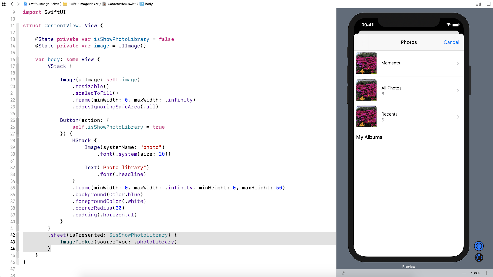

# An image picker for SwiftUI

While you can use the UIViewRepresentable protocol to wrap a UIKit view, but how about a view controller? You probably need to use camera or access the user’s photo library in your app. So, how can use integrate the UIImagePickerController class into your SwiftUI view?

In this tutorial, we will walk you through the integration by using the UIViewControllerRepresentable protocol. For the full tutorial, please refer it here:

https://www.appcoda.com/swiftui-camera-photo-library/
